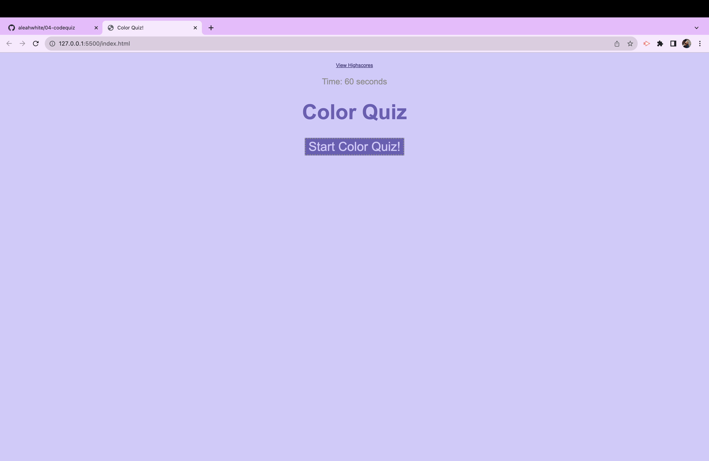

# Challenge 4 - Coded Color Quiz

## Description:
The motivation for this website was to use HTML, JavaScript, and CSS to create a 60 second quiz with a series of questions about colors! When you get the question you will be given three options for an answer. Answer right, you will get a king message but answer wrong and you will get -5 from your score. 

## Image and link:

Link to deployed website: 

## Installation:
N/A

## Usage:
This website is used for anyone looking for a fun way to test their basic knowledge of colors!! At the end you can put in your initials and score.

## Credits:
N/A

## License:
Please refer to the MIT License in this repository!